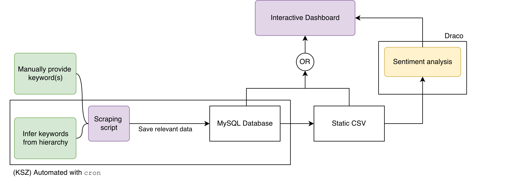
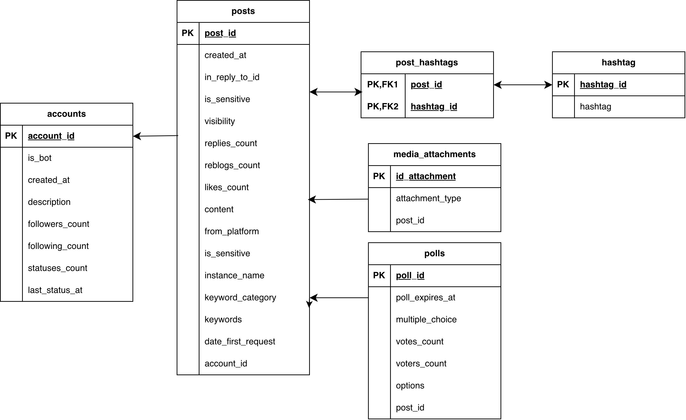

# Scraping water-based social media data

This project contains work that takes place in two distinct repositories. On one end, we have data extraction and analysis, contained in this repository, which includes the `cron`-automated scraping of data and collection in a MySQL database. On the second end, we have static data handling and analysis. 

Both of these tasks are handled in this repository accross two SSH servers (KSZ and Draco) via two auxiliary scripts. More info on the usage is contained in the sections that follow. A basic dashboard app allowing for visual data analysis is contained in the `waterviz` repo.



## Data extraction

Currently, we use `main.py` to extract data on a certain keyword and keyword category and save it to a database.

Example usage of the script:

```bash
$ python3 main.py bluesky 1000 --keywords "water scarcity" --keyword_category "water conflict"
```

If the `keywords` and `keyword_category` arguments are not provided explicitly, the script will run the scraping process for all keywords contained in the file `hierarchy-social-media.txt`.

Due to the scarcity of some of the rare keywords, we provide an additional argument that specifies a minimum post number for a given keyword. For example, if a given keyword has less than `k = 1000` posts, it is omitted from the scraping process and not taken into consideration for further analysis.


## Instructions

### Prerequisites

In order to run the main scraping script, make sure to install the necessary requirements:

```bash
$ pip install -r requirements.txt
```

The directory must also contain a `.env` file with the necessary credentials for both the MySQL user and the social media accesses:

```text
# Credentials for scraping
BLUESKY_HANDLE=
BLUESKY_APP_PASSWORD=
ACCESS_TOKEN=

# Credentials for DB access
DB_HOST=mysql8p2.uni-jena.de
DB_PORT=3306
DB_NAME=i86hoxb7_thwicsonar

DB_USER=
DB_PASSWORD=
```

Finally, the university's `sci-std-VPN` must be active in order to connect to the MySQL server, and for the SSH server if one intends to use `cron` to run the code automatically. Follow the [wiki page](https://wiki.uni-jena.de/spaces/URZ010SD/pages/22453512/VPN+-+zuhause+und+unterwegs) to setup the VPN. 

For example, we can use `OpenConnect` on a Linux machine:

```bash
$ sudo openconnect -b --useragent 'AnyConnect' --user=ab12cde@uni-jena.de --pid-file=/var/run/vpn.pid --timestamp --syslog vpn.sci.uni-jena.de
```

### Run with `cron`

As opposed to manually running the scraping script with specific keywords like in the example above, we use the `cron` scheduler to automatically execute the script in set time intervals. This repository is cloned onto a remote server accessed via SSH, where we submit one `cron` job for each platform. The result is an automatic scrape taking place once a week.

Once the `sci-std-VPN` is active, connect to the SSH server with your given username:

```bash
$ ssh lab12cde@thwicsonar.inf-bb.uni-jena.de
```

This repo can then be cloned and setup on the server with a virtual environment. Once this is done, one or multiple `cron` jobs can be submitted in order to automatically run the code whenever specified. Use `crontab -l` to check if the correct command and time have been submitted for each job.

### Sentiment analysis

The sentiment analysis is designed to take place in two separate steps. The `fetch_posts.py` saves relevant columns from the database table to a CSV table. For faster computation, we run the sentiment analysis from a separate Draco cluster with the use of GPUs. This results in the following two auxiliary scripts being used on KSZ:

```text
$ bash make_snapshot.sh
$ bash run_analysis.sh
```

The first syncs up the datasets used by the visualization and analysis components, the second runs the analysis on the most recent snapshot via Draco (a separate cluster that allows for GPU usage via Slurm).

Or submit a Slurm job manually from Draco:

```text
$ ssh qe75hep@login1.draco.uni-jena.de
$ git clone https://github.com/fusion-jena/waterscrape.git
$ cd waterscrape
$ sbatch run_slurm.sh
```

### Database structure


